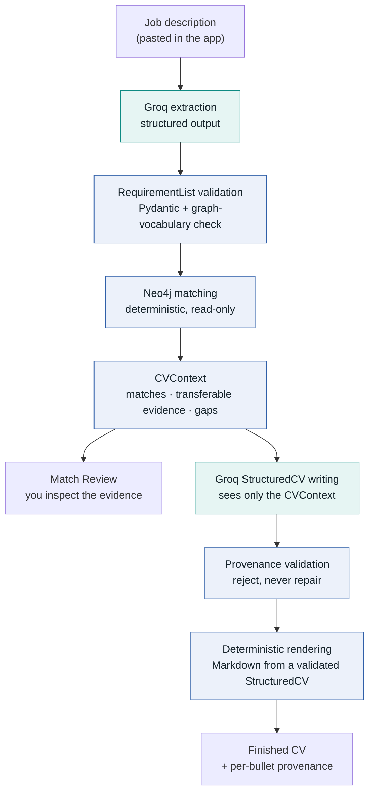
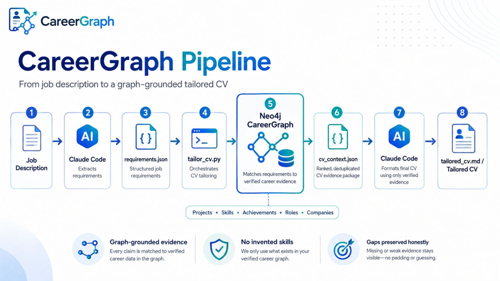

# CareerGraph

*The LLM writes. The graph proves.*

A personal professional-evidence graph in Neo4j Aura, matched against job descriptions and turned
into a clean, provenance-preserving CV — with every claim traceable back to real graph evidence.

> **Status: early-stage, private/demo.** There is no authentication, no user accounts and no
> consent flow. Do not expose this to other people's CVs or put it on the public internet until
> those controls exist (see [Privacy and security](#privacy-and-security)). Expect rough edges and
> breaking changes.

## How it works

Paste a job description. CareerGraph does everything else without you leaving the app:

1. **Job** — you paste the job description and click **Analyze job**.
2. **Match** — Groq extracts a structured requirement list; the deterministic Neo4j matcher finds
   the evidence; you inspect matches, transferable capabilities and gaps.
3. **CV** — you click **Generate evidence-backed CV**; Groq writes it from the verified evidence,
   every claim is checked against that evidence, and the finished CV is rendered with a per-bullet
   provenance view.



Teal boxes are the two LLM stages; blue boxes are deterministic. The model can extract and write
language, but **it cannot create evidence**: the graph decides what is true, and anything the
model produces that the graph cannot support is rejected.

## Evidence grounding

| Guarantee | How it is enforced |
| --- | --- |
| The matcher never sees free text | Extraction output is validated into the existing `RequirementList` before `matching.py` runs; the LLM layer never runs Cypher and never talks to Neo4j except through the existing read-only vocabulary check. |
| No invented ontology | Related capabilities the model suggests are checked against the real skill vocabulary (`capability_suggest.check_candidates`); unknown ones are discarded. |
| Literal gaps stay gaps | The model is told which requirements have **no** evidence; a validator rejects any CV that names one anywhere (headline, profile, bullets, skills). Transferable evidence may support a broader capability, never the missing technology. |
| Every bullet is provable | Each bullet must cite evidence ids that exist in the `CVContext`, and the evidence must belong to that bullet's own experience. A missing, empty or unknown id rejects the whole CV — ids are never silently dropped. |
| No invented facts | Titles, employers, places and dates are copied from the graph, not written by the model. Skills must come from the supported skill list. Numbers in prose must appear in the cited evidence. |
| No graph-speak in the CV | Evidence ids, match confidence, "transferable evidence" and similar terms are rejected if they leak into prose. |
| Render only what was verified | `cv_generation.build_cv_document` is the single choke point: writer → provenance validation → render. The renderer only ever receives a validated `StructuredCV`, and the model never writes Markdown. |
| The browser cannot supply evidence | The `CVContext` stays on the server under an unguessable `analysisId`; `/api/cv/generate` takes only that id. |

**What these checks cannot do.** They are deterministic and lexical. They catch the dominant
failure (a model pulling technologies from the job description into the CV), but not a paraphrase
of a gap ("cloud monitoring service" for CloudWatch) or a wrong-but-plausible sentence built from
supported words. That is why every bullet carries citable evidence and the CV page lets you open
**Where each claim comes from** for every line. Profile and headline are checked for gaps,
numbers and graph-speak, but — unlike bullets — are not bound to specific evidence ids.

## Layout

```
CareerGraph/
├── pipeline/           Deterministic pipeline: matching, evidence retrieval, CV writer/renderer inputs.
│                       No LLM calls. Shared dependencies (neo4j, pydantic) live in requirements.txt.
├── backend/            FastAPI app -- orchestrates the pipeline modules, reimplements nothing
│   └── llm/            ALL provider-specific code: Groq client, extraction, CV writer, validators
├── frontend/           React + TypeScript (Vite, React Router, React Flow)
├── data/               Source/seed data (gitignored -- see data/README.md; bring your own)
├── output/             CLI-generated artifacts (gitignored). The web app writes nothing here.
├── tests/              pipeline/Neo4j tests, plus offline/ (mocked, no key) and live/ (opt-in)
└── docs/
```

Provider code is isolated behind the existing abstractions: `llm_provider.LLMProvider` (extraction)
and `cv_writer.CVWriter` (writing). To add another provider, implement those two interfaces under
`backend/llm/` and select it in `llm/factory.py` — nothing else changes.

## Run it

### Backend (FastAPI, port 8000)

```
cd backend
python -m pip install -r requirements.txt    # pulls in ../pipeline/requirements.txt too
python -m uvicorn main:app --reload --port 8000
```

Create a `.env` file in the repo root — copy `.env.example` and fill in your values. It needs your
Neo4j Aura credentials plus the LLM settings below.

### Frontend (Vite dev server, port 5173)

```
cd frontend
npm install
npm run dev
```

Open `http://localhost:5173`.

## Groq setup

1. Create an API key in the [Groq console](https://console.groq.com/keys).
2. **Enable Zero Data Retention** (recommended, see [Privacy](#privacy-and-security)): Groq console →
   *Data Controls* → turn on **Zero Data Retention** (organization admins only).
3. Put the key in the **backend** environment — the repo-root `.env` locally, or your deployment's
   environment variables — and restart the backend. The key is never read from the browser, never
   returned by an API, never logged and never committed.

```env
LLM_PROVIDER=groq
GROQ_API_KEY=<your key>
LLM_EXTRACTION_MODEL=openai/gpt-oss-120b
LLM_WRITING_MODEL=openai/gpt-oss-120b
LLM_REQUEST_TIMEOUT_SECONDS=60
LLM_MAX_RETRIES=3
```

| Variable | Default | Meaning |
| --- | --- | --- |
| `LLM_PROVIDER` | `groq` | `groq` (production) or `dev` (explicit development fallbacks, below) |
| `GROQ_API_KEY` | — | Required when `LLM_PROVIDER=groq`. A blank value counts as unset. |
| `LLM_EXTRACTION_MODEL` | `openai/gpt-oss-120b` | Model used for requirement extraction |
| `LLM_WRITING_MODEL` | `openai/gpt-oss-120b` | Model used for CV writing |
| `LLM_REQUEST_TIMEOUT_SECONDS` | `60` | Per-request timeout |
| `LLM_MAX_RETRIES` | `3` | Retries *after* the first attempt (so up to 4 calls) |
| `LLM_STRICT_SCHEMA` | `true` | Groq strict structured-output mode (optional) |
| `LLM_MAX_JOB_DESCRIPTION_CHARS` | `20000` | Longest job description accepted (optional) |
| `LLM_MAX_CV_CONTEXT_CHARS` | `60000` | Largest evidence payload sent to the writer (optional) |

Settings are read from the process environment first, then from `.env`. If `LLM_PROVIDER=groq` and
the key is missing, the app still starts (the graph explorer works) and any analysis or CV request
returns a clear `llm_not_configured` error; a warning is logged at startup.

### Switching models

Model ids are read only from the two `LLM_*_MODEL` variables — nothing is hardcoded elsewhere.
To use the smaller model for extraction only:

```env
LLM_EXTRACTION_MODEL=openai/gpt-oss-20b
LLM_WRITING_MODEL=openai/gpt-oss-120b
```

Restart the backend. The model in use is shown in each screen's collapsed **Technical details**.
Strict mode is supported on the `openai/gpt-oss-*` models; if you point a variable at a model
without it, set `LLM_STRICT_SCHEMA=false` (the response is still validated the same way).

### Development fallbacks (no key, no network)

`LLM_PROVIDER=dev` selects the old non-LLM implementations: extraction by keyword matching (or the
curated `data/requirements.json` for the demo job description), and the rule-based
`DeterministicCVWriter`. They exist for offline development and as a regression oracle, are never
used implicitly — **a failed Groq call is an error, never a silent downgrade** — and every screen
labels their output as *Development fallback*.

## Errors and retries

All LLM failures become a JSON error `{"detail": {"code", "message", "retryable"}}` with a fixed,
non-sensitive message. Raw provider error bodies, prompts and model output never reach the
browser or the logs.

| Situation | HTTP | `code` | Retried automatically? |
| --- | --- | --- | --- |
| `GROQ_API_KEY` missing / bad `LLM_*` value | 503 | `llm_not_configured` | no |
| Provider rejected the key (401/403) | 502 | `llm_auth_failed` | no |
| Rate limited (429) | 429 | `llm_rate_limited` | yes |
| Timeout | 504 | `llm_timeout` | yes |
| Provider 5xx / connection failure | 503 | `llm_unavailable` | yes |
| Response failed schema/domain validation | 502 | `llm_invalid_response` | no |
| CV failed provenance validation | 502 | `cv_provenance_failed` | no |
| No requirements found / no evidence to write from | 422 | `no_requirements` / `no_evidence` | no |
| Input over the size limits | 413 | `input_too_large` | no |
| Expired or unknown analysis | 404 | `analysis_not_found` | no |

Automatic retries apply only to timeouts, HTTP 429 and transient 5xx, with exponential backoff and
full jitter (base 0.5 s, cap 8 s), honouring `Retry-After` up to 20 s (longer waits fail fast).
Authentication, configuration and validation failures are never re-sent. Worst case is
`1 + LLM_MAX_RETRIES` attempts × the timeout, plus backoff — with the defaults, a few minutes. A
validation or provenance failure is surfaced with a *try again* option rather than looped on.

## Privacy and security

CVs contain personal information. **This is a private/demo implementation** — no authentication,
no per-user isolation, no consent flow. Do not accept external users until those exist.

- **What is sent to Groq.** Extraction: the pasted job description. Writing: only the selected
  `CVContext` — the evidence stories and achievements matched for this job, skill names, the list of
  literal gaps and the job's skill/importance labels. Never the whole graph, never Neo4j
  credentials, never the candidate's name, never internal scores. E-mail addresses and phone numbers
  are redacted from evidence text (best-effort pattern matching — keep contact details out of
  achievement text).
- **Server-side only.** Every LLM call happens on the backend. The key never appears in frontend
  code or any API response (`GET /api/llm/status` reports provider, models and a `configured`
  boolean only).
- **Content-free logs.** Logs contain operation names, model ids, attempt counts, latency, token
  counts and analysis ids — never job descriptions, evidence, CVs, prompts, keys or provider errors.
- **Retention on this side.** Analyses live in server memory only (max 100, expiring after 1 hour,
  lost on restart). Nothing is written to disk — the old shared `output/requirements.json` is gone,
  so concurrent analyses cannot overwrite or leak into each other.
- **Enable Zero Data Retention on Groq** (Data Controls → *Zero Data Retention*). Without it, Groq
  may retain customer data for up to 30 days for reliability and abuse monitoring in limited cases.
- **Data leaves the EU.** Groq's documentation states customer data is held in US-based Google
  Cloud storage, with standard contractual clauses available for international transfers and no EU
  residency option. Before accepting any external user, reflect this in a privacy policy and confirm
  your legal basis and transfer mechanism.
- **Prompt injection.** Job descriptions and evidence are passed as data with instructions to ignore
  embedded commands, and the output is schema-constrained and validated. A hostile job description
  can at worst skew extraction; it cannot make the CV claim a technology the graph lacks.

## Cost model

Groq bills per token. At the time of writing the published prices (verify on the
[Groq pricing page](https://groq.com/pricing) — they change) are:

| Model | Input / 1M tokens | Output / 1M tokens |
| --- | --- | --- |
| `openai/gpt-oss-120b` | $0.15 | $0.60 |
| `openai/gpt-oss-20b` | $0.075 | $0.30 |

One job = two calls. Rough size with the defaults: extraction ≈ 2–4k input and 2–3k output tokens
(gpt-oss counts its reasoning tokens as output); CV writing ≈ 3–8k input and 3–4k output. That is
on the order of **half a cent per job** (≈ 10k input × $0.15/M + ≈ 6k output × $0.60/M ≈ $0.005),
and it scales linearly with job-description length and the amount of matched evidence. These are
estimates, not measurements: each screen's *Technical details* shows the real token counts per call.

## Known limitations

- Provenance checks are deterministic and lexical (see [Evidence grounding](#evidence-grounding)); a
  paraphrased gap or a wrong-but-plausible sentence can pass. Review the CV before sending it.
- Profile and headline are not bound to evidence ids (bullets are).
- A rejected CV is not auto-regenerated — you click *Generate again*. There is no streaming, so the
  Match and CV steps show a busy state (with an elapsed-seconds counter) while the request runs;
  latency has not been measured against the live API yet.
- Analyses are held in memory: a backend restart or a one-hour wait means re-running **Analyze job**.
  The store is per-process, so run a **single** uvicorn worker/instance — with several, CV
  generation can land on a process that never saw the analysis and return `analysis_not_found`
  (shared storage would be needed to scale out).
- Neo4j credentials are still read only from the `.env` file (pre-existing behaviour); the LLM
  settings also honour real environment variables. CORS allows `localhost:5173` only.
- One CV template (*Modern*); the candidate name on the CV is a fixed default in `cv_writer.py`.
- Skill coverage is bounded by the graph's vocabulary; requirements the graph has no node for are
  always reported as gaps (only capability-level *related* evidence can soften that, and never in
  the CV's wording).
- Single user, no authentication (see above).

**Not part of this change:** CV-file parsing, ontology expansion/ingestion, multi-job ranking,
authentication, and any general agent or tool-calling functionality.

## Tests

```
# Offline suite -- mocked Groq + Neo4j, needs NO key and NO network
python -m pip install -r backend/requirements-dev.txt
python -m pytest tests/offline
python tests/test_presentation_flow.py         # frontend contract (static checks)

# Optional live Groq check (real API calls, real cost) -- skipped unless opted in
CAREERGRAPH_LIVE_GROQ=1 python -m pytest tests/live -v -s

# Neo4j-backed suites (need your own Aura instance; no mocking)
python pipeline/metrics.py
python pipeline/matching.py
python tests/test_tailor_cv.py
python tests/test_capability_suggest.py
python tests/test_cv_writer.py
python tests/test_cv_evidence.py
python tests/test_llm_provider.py
cd backend && python -m pytest test_api.py test_requirements_route.py   # uses LLM_PROVIDER=dev

# Frontend
cd frontend && npx tsc -b && npm run lint && npm run build
```

## Development and manual tooling

The deterministic pipeline can still be run without the web app, and the older manual,
Claude-assisted workflow (a human or Claude Code hand-authoring `requirements.json` /
`structured_cv.json`) still works for offline use. It is **not** the application's flow:

```
python -m pip install -r pipeline/requirements.txt
python pipeline/extract_requirements.py data/jobs.txt   # manual checkpoint: validates data/requirements.json
python pipeline/tailor_cv.py data/requirements.json      # -> output/cv_context.json
python pipeline/cv_evidence.py output/cv_context.json    # -> output/cv_evidence.json (grouped evidence package)
python pipeline/write_cv.py output/cv_context.json       # -> output/structured_cv.json (rule-based)
```

`/api/requirements/analyze` also remains as a dev/advanced endpoint: it accepts an
already-extracted `RequirementList`, validated by exactly the schema LLM extraction output passes
through, and runs the same matching stage.

<details>
<summary>Historical: the original manual pipeline</summary>

The diagram below shows the project's first design, in which Claude Code extracted requirements and
formatted the CV by hand via `requirements.json` and `cv_context.json`. It is kept for context and
is **out of date**; the flow above replaces both manual steps.

<p align="center">
  
</p>

</details>
