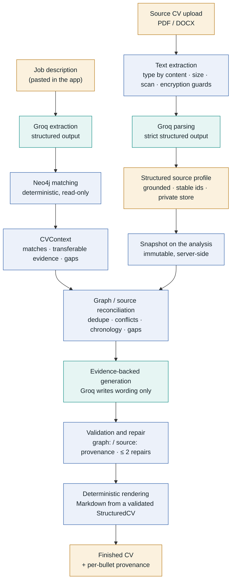

# CareerGraph

*The LLM writes. The graph proves.*

A personal professional-evidence graph in Neo4j Aura, matched against job descriptions and turned
into a clean, provenance-preserving CV — with every claim traceable back to real graph evidence, or to
your own uploaded CV.

> **Status: early-stage, private/demo.** There is no authentication, no user accounts and no
> consent flow. Do not expose this to other people's CVs or put it on the public internet until
> those controls exist (see [Privacy and security](#privacy-and-security)). Expect rough edges and
> breaking changes.

## How it works

Upload your CV once, then paste job descriptions. CareerGraph does everything else without you leaving
the app:

0. **Source CV** *(optional, once)* — you upload your complete base CV (PDF or DOCX). It is parsed into a
   structured profile, stored privately, and you can review and correct it. See [Source CV](#source-cv).
1. **Job** — you paste the job description and click **Analyze job**.
2. **Match** — Groq extracts a structured requirement list; the deterministic Neo4j matcher finds
   the evidence; you inspect matches, transferable capabilities and gaps — and how your Source CV's
   positions line up with your career graph.
3. **CV** — you click **Generate evidence-backed CV**; Groq writes it from the verified evidence, every
   claim is checked (and automatically repaired if it fails), and the finished CV is rendered with a
   per-bullet provenance view.



Teal boxes are the model stages; blue boxes are deterministic; amber boxes are data. The model can
extract and write language, but **it cannot create evidence**: the graph (and your own CV, for what the
graph does not know) decides what is true, and anything the model produces that they cannot support is
rejected. Without a Source CV the left-hand branch and the reconciliation step are skipped and the
original graph-only flow runs unchanged. More detail: [docs/architecture.md](docs/architecture.md).

## Source CV

The Source CV is your **complete base CV**. It is what turns a generated CV from "only the evidence-backed
sections tailored from the graph" into a **complete CV**: your contact details, links, full employment
chronology, education, languages and certifications.

**Without one, everything still works** — the result is just the graph-backed sections, and the Job page
says so.

### Using it

On the first page, above the job-description box: drag a file in or choose one. The card shows the real
stage the server is in — *uploading → reading the text → parsing → checking every value → saving* — then a
compact preview. **Review and correct** expands contact details, employment, education, languages,
certifications and links, and lets you edit them. **Replace CV** swaps it; **Delete source CV** (separate,
with a confirmation) removes it. Anything the parse could not verify, and anything that disagrees with your
career graph, is listed for your review.

### Formats and limits

| | |
| --- | --- |
| Accepted | Text-based **PDF** and **DOCX** |
| Rejected | Legacy `.doc`, other Office files, images, encrypted / password-protected files, scans (image-only PDFs), empty or damaged files, more than 15 PDF pages |
| Size | 5 MB (enforced before the upload is read; `413 file_too_large`) |
| Text sent to the model | up to `LLM_MAX_SOURCE_CV_CHARS` (default 40 000) |

The file type is decided from its **content** (`%PDF-` header; a DOCX package with `word/document.xml`) —
never from the filename or the browser's content-type. DOCX is read with the standard library only:
nothing is extracted to disk, entry count / sizes / compression ratio / entry names are bounded, and XML
carrying a DTD or entity declaration is refused. Header and footer text (where contact details usually
live), tables, text boxes and hyperlink targets are read too.

### Data authority

| Neo4j is authoritative for | The Source CV is authoritative for |
| --- | --- |
| Detailed achievements already in the graph, evidence-backed bullets | Name, e-mail, telephone, city/country |
| Skills and capabilities | LinkedIn, GitHub, portfolio and other links |
| Quantified claims (on roles the graph has evidence for) | The complete job chronology, incl. roles the graph lacks |
| Literal matches, transferable evidence and **gaps** | Education not in the graph; languages; certifications |
| Existing graph provenance | Statements traceable to the uploaded document |

If a role exists in both, it is deduplicated (normalised employer + similar title + overlapping dates),
the graph's evidence is preferred, and the CV's facts only **fill in** what the graph lacks. If they
**disagree** (dates, title, location, qualification) the disagreement is recorded, shown to you, and the
disputed detail is **left out of the CV** until you explicitly choose *use my CV* or *use my career graph*.
Nothing is chosen silently, and a model never overwrites a graph fact or invents something to reconcile
two sources.

Every position in your CV appears in the generated CV **exactly once**. Relevant positions get
evidence-backed bullets; the others are kept as one compact line (optionally one short supported bullet)
under **Additional Experience**. Nothing is invented to make a position look relevant, chronology is never
cut to fit a page target (you get a length warning instead), and possible **gaps in the timeline are
reported, never filled**.

### What the model sees, and what it does not

* **Parsing** sends your CV text to Groq — that is unavoidable, and the card says so before you upload.
* **Tailoring** never sends contact details or your name: they are rendered from the validated profile,
  and the model has no field to write them in. E-mail/phone patterns and your own contact values are
  redacted from every text it does see. Employers, titles and periods are sent (relevance depends on them).

### Provenance

Every bullet and the profile paragraph cite evidence in one of two namespaces:

* `graph:<evidence id>` — verified against Neo4j (existing ids, unchanged);
* `source:<source fact id>` — a statement from your CV, from the profile **snapshot** the analysis holds.

Ids without a namespace, in the wrong one, unknown, or belonging to another entry are rejected. The CV
page's **Where each claim comes from** labels each piece of evidence *Achievement / Record / Transferable*
(graph) or *Your CV*. Internal ids are never shown.

If a draft fails validation, the specific invalid claims go back to the model (at most **two** times) to be
rewritten or removed — only those — and the whole result is revalidated. If it still fails, you get a
report of rule codes and counts; no rule is ever relaxed.

### Replacement, deletion, versions

* One active Source CV. **Replace** parses the new file first; only if parsing *and* validation succeed is
  the stored profile and original swapped (atomically). A failed parse leaves the previous CV untouched.
* **Delete** removes the stored original *and* the parsed profile.
* Every save bumps a `revision`. Edits carry the revision they were based on; a stale edit is refused
  (`409 profile_version_conflict`).
* An **analysis holds a snapshot** of the profile as it was when it ran. Editing, replacing or deleting the
  stored CV afterwards never changes an existing analysis; the Match and CV pages tell you when the stored
  CV has moved on and to re-run **Analyze job**.
* **Re-parse** runs the model over the stored original again (this replaces your corrections).

### Where it is stored (privacy warning)

The original upload and the parsed profile — **your name, contact details and full work history** — are
stored **unencrypted on this server's disk**, under `data/private/source_cv/` (override with
`CAREERGRAPH_PRIVATE_DIR`). That directory is gitignored; never commit it, and do not put this app on a
shared machine or the public internet. Writes are atomic; file names are generated (never taken from the
upload); no CV content, contact detail, filename or path is ever logged or returned by the API.

**Single-user demo only:** there is exactly one Source CV for the whole server — no accounts, no
per-user isolation, no login. `SourceCvStore` (`backend/source_cv/store.py`) is the seam for replacing the
file store with authenticated database storage.

### API

| Endpoint | Purpose |
| --- | --- |
| `POST /api/source-cv` | Multipart upload (`file`) → extract → parse → validate → persist → the review view. Send `Accept: application/x-ndjson` for progress events (`parsing`, `validating`, `saving`, then `done`/`error`). |
| `POST /api/source-cv/reparse` | Parse the stored original again |
| `GET /api/source-cv` | The parsed profile for review (no excerpts, hash, paths or raw text) |
| `GET /api/source-cv/status` | exists · filename · timestamps · revision · warnings · conflicts · completeness · parser |
| `PUT /api/source-cv` | Save corrections (`expectedRevision`; existing ids echoed back; conflict resolutions) |
| `DELETE /api/source-cv` | Delete the original and the profile |

`POST /api/cv/generate` is unchanged in shape (`analysisId`, `template`) plus an optional `pageBudget`
(1–4). The browser never supplies evidence, a profile or a context: the server takes both from the
analysis.

## Evidence grounding

| Guarantee | How it is enforced |
| --- | --- |
| The matcher never sees free text | Extraction output is validated into the existing `RequirementList` before `matching.py` runs; the LLM layer never runs Cypher and never talks to Neo4j except through the existing read-only vocabulary check. |
| No invented ontology | Related capabilities the model suggests are checked against the real skill vocabulary (`capability_suggest.check_candidates`); unknown ones are discarded. |
| Literal gaps stay gaps | The model is told which requirements have **no** evidence; a validator rejects any CV that names one anywhere (headline, profile, bullets, skills) — even if the Source CV mentions it. Transferable evidence may support a broader capability, never the missing technology. |
| Every bullet is provable | Each bullet must cite evidence ids that exist (in the right namespace) and belong to that bullet's own entry. A missing, empty or unknown id rejects the CV — ids are never silently dropped. |
| No invented facts | Titles, employers, places, dates, names and contact details are copied from the verified record, not written by the model. Skills must come from the graph-supported list. Numbers must appear in the cited evidence. |
| The parse is grounded | Every parsed value and excerpt must be found in the uploaded document; an employer, title or institution that is not, rejects the whole parse. Statements are dropped (with a visible warning) if they say more than their own excerpt. Dates are normalised deterministically; a year is never given a month. |
| Source claims are verified twice | Lexically (numbers, terms, seniority, qualifications) and by an independent model pass that must return *supported*. |
| No graph-speak in the CV | Evidence ids, match confidence, "transferable evidence" and similar terms are rejected if they leak into prose. |
| Render only what was verified | `cv_generation` is the single choke point: writer → validation (→ repair) → render. The renderer only ever receives a validated `StructuredCV`. |
| The browser cannot supply evidence | The `CVContext` and the Source CV snapshot stay on the server under an unguessable `analysisId`. |

**What these checks cannot do.** The deterministic ones are lexical: they catch the dominant failure (a
model pulling technologies from the job description into the CV) but not every paraphrase of a gap or a
wrong-but-plausible sentence. The semantic verifier narrows that for source-backed claims, but it is a
model and can be wrong. That is why every bullet carries citable evidence and the CV page lets you open
**Where each claim comes from** for every line.

## Layout

```
CareerGraph/
├── pipeline/           Deterministic pipeline: matching, evidence retrieval, CV writer/renderer inputs.
│                       No LLM calls. Shared dependencies (neo4j, pydantic) live in requirements.txt.
├── backend/            FastAPI app -- orchestrates the pipeline modules, reimplements nothing
│   ├── llm/            ALL provider-specific code: Groq client, extraction, parsers, CV writers, validators
│   └── source_cv/      Source CV: extraction, strict profile, grounding, private store, reconciliation
├── frontend/           React + TypeScript (Vite, React Router, React Flow)
├── data/               Source/seed data (gitignored -- see data/README.md; bring your own)
│   └── private/        Stored Source CV (gitignored, created at runtime)
├── output/             CLI-generated artifacts (gitignored). The web app writes nothing here.
├── tests/              pipeline/Neo4j tests, plus offline/ (mocked, no key) and live/ (opt-in)
└── docs/               architecture.md
```

Provider code is isolated behind the existing abstractions: `llm_provider.LLMProvider` (extraction),
`cv_writer.CVWriter` (graph-only writing), `llm.source_profile.SourceCvParser` (parsing) and
`llm.complete_writers.CompleteCvWriter` (source-aware writing). To add another provider, implement those
interfaces under `backend/llm/` and select it in `llm/factory.py` — nothing else changes.

## Run it

### Backend (FastAPI, port 8000)

```
cd backend
python -m pip install -r requirements.txt    # pulls in ../pipeline/requirements.txt too
python -m uvicorn main:app --reload --port 8000
```

Create a `.env` file in the repo root — copy `.env.example` and fill in your values. It needs your
Neo4j Aura credentials plus the LLM settings below.

### Frontend (Vite dev server, port 5173)

```
cd frontend
npm install
npm run dev
```

Open `http://localhost:5173`.

## Groq setup

1. Create an API key in the [Groq console](https://console.groq.com/keys).
2. **Enable Zero Data Retention** (recommended, see [Privacy](#privacy-and-security)): Groq console →
   *Data Controls* → turn on **Zero Data Retention** (organization admins only).
3. Put the key in the **backend** environment — the repo-root `.env` locally, or your deployment's
   environment variables — and restart the backend. The key is never read from the browser, never
   returned by an API, never logged and never committed.

```env
LLM_PROVIDER=groq
GROQ_API_KEY=<your key>
LLM_EXTRACTION_MODEL=openai/gpt-oss-120b
LLM_WRITING_MODEL=openai/gpt-oss-120b
LLM_REQUEST_TIMEOUT_SECONDS=60
LLM_MAX_RETRIES=3
```

| Variable | Default | Meaning |
| --- | --- | --- |
| `LLM_PROVIDER` | `groq` | `groq` (production) or `dev` (explicit development fallbacks, below) |
| `GROQ_API_KEY` | — | Required when `LLM_PROVIDER=groq`. A blank value counts as unset. |
| `LLM_EXTRACTION_MODEL` | `openai/gpt-oss-120b` | Model for requirement extraction **and Source CV parsing** |
| `LLM_WRITING_MODEL` | `openai/gpt-oss-120b` | Model for CV writing, repair and claim verification |
| `LLM_REQUEST_TIMEOUT_SECONDS` | `60` | Per-request timeout |
| `LLM_MAX_RETRIES` | `3` | Retries *after* the first attempt (so up to 4 calls) |
| `LLM_STRICT_SCHEMA` | `true` | Groq strict structured-output mode (optional) |
| `LLM_MAX_JOB_DESCRIPTION_CHARS` | `20000` | Longest job description accepted (optional) |
| `LLM_MAX_CV_CONTEXT_CHARS` | `60000` | Largest evidence payload sent to the writer (optional) |
| `LLM_MAX_SOURCE_CV_CHARS` | `40000` | Longest CV text sent to the parser (optional) |
| `CAREERGRAPH_PRIVATE_DIR` | `data/private` | Where the Source CV is stored (optional) |

Settings are read from the process environment first, then from `.env`. If `LLM_PROVIDER=groq` and
the key is missing, the app still starts (the graph explorer, and reviewing/editing/deleting a stored
Source CV, work) and any analysis, upload or CV request returns a clear `llm_not_configured` error; a
warning is logged at startup.

### Switching models

Model ids are read only from the two `LLM_*_MODEL` variables — nothing is hardcoded elsewhere.
To use the smaller model for extraction and parsing only:

```env
LLM_EXTRACTION_MODEL=openai/gpt-oss-20b
LLM_WRITING_MODEL=openai/gpt-oss-120b
```

Restart the backend. The model in use is shown in each screen's collapsed **Technical details**.
Strict mode is supported on the `openai/gpt-oss-*` models; if you point a variable at a model
without it, set `LLM_STRICT_SCHEMA=false` (the response is still validated the same way).

### Development fallbacks (no key, no network)

`LLM_PROVIDER=dev` selects the non-LLM implementations: extraction by keyword matching (or the curated
`data/requirements.json` for the demo job description), the rule-based `DeterministicCVWriter`, and — for
the Source CV — a heuristic parser for conventionally laid-out CVs and a writer that reuses verbatim graph
evidence (source-only positions become compact entries). They exist for offline development and as a
regression oracle, are never used implicitly — **a failed Groq call is an error, never a silent
downgrade** — every screen labels their output as *Development fallback*, and their output goes through
exactly the same validation.

## Errors and retries

All failures become a JSON error `{"detail": {"code", "message", "retryable"}}` with a fixed,
non-sensitive message. Raw provider error bodies, prompts, model output, CV text, contact details,
filenames and storage paths never reach the browser or the logs.

| Situation | HTTP | `code` | Retried automatically? |
| --- | --- | --- | --- |
| `GROQ_API_KEY` missing / bad `LLM_*` value | 503 | `llm_not_configured` | no |
| Provider rejected the key (401/403) | 502 | `llm_auth_failed` | no |
| Rate limited (429) | 429 | `llm_rate_limited` | yes |
| Timeout | 504 | `llm_timeout` | yes |
| Provider 5xx / connection failure | 503 | `llm_unavailable` | yes |
| Response failed schema/domain validation | 502 | `llm_invalid_response` | no |
| CV failed provenance validation (after ≤ 2 repairs when a Source CV is used) | 502 | `cv_provenance_failed` | no |
| No requirements found / no evidence to write from | 422 | `no_requirements` / `no_evidence` | no |
| Input over the size limits | 413 | `input_too_large` | no |
| Expired or unknown analysis | 404 | `analysis_not_found` | no |
| Unsupported file type (by content) | 415 | `unsupported_file_type` | no |
| File over the upload limit | 413 | `file_too_large` | no |
| Empty file / no text | 422 | `empty_document` | no |
| Scanned / image-only PDF | 422 | `scanned_or_unreadable_pdf` | no |
| Encrypted or password-protected file | 422 | `encrypted_document` | no |
| Malformed file / text could not be read | 422 | `extraction_failed` | no |
| More text than can be sent to the model | 413 | `document_too_long` | no |
| Parsed profile failed schema/grounding validation (nothing stored) | 502 | `llm_schema_rejected` | user can retry |
| Nothing CV-like in the document | 422 | `no_cv_content` | no |
| Stale edit / racing upload | 409 | `profile_version_conflict` | no |
| Invalid correction | 422 | `invalid_profile` | no |
| No stored Source CV | 404 | `source_cv_not_found` | no |
| Store unreadable / not writable | 500 | `storage_failure` | no |

Automatic retries apply only to timeouts, HTTP 429 and transient 5xx, with exponential backoff and
full jitter (base 0.5 s, cap 8 s), honouring `Retry-After` up to 20 s (longer waits fail fast).
Authentication, configuration and validation failures are never re-sent. Worst case is
`1 + LLM_MAX_RETRIES` attempts × the timeout per model call, plus backoff. With a Source CV, one
generation is one write call, at most two repair calls, and one verification call per validation round.

## Privacy and security

CVs contain personal information. **This is a private/demo implementation** — no authentication,
no per-user isolation, no consent flow. Do not accept external users until those exist.

- **What is sent to Groq.** Extraction: the pasted job description. **Source CV parsing: the full text of
  your uploaded CV (including contact details), once per upload/re-parse.** Writing: only the selected
  evidence — graph evidence stories and achievements matched for this job, statements from your Source CV
  for its positions, skill names, the literal gaps and the job's skill/importance labels — plus, for the
  verifier, each source-backed claim with the text it cites. Never the whole graph, never Neo4j
  credentials, and **never your name or contact details during tailoring** (they are rendered locally).
  E-mail addresses, phone numbers and your own contact values are redacted from evidence text
  (best-effort pattern matching).
- **Server-side only.** Every LLM call happens on the backend. The key never appears in frontend
  code or any API response (`GET /api/llm/status` reports provider, models and a `configured`
  boolean only).
- **Content-free logs.** Logs contain operation names, model ids, attempt counts, latency, token
  counts, revision numbers and analysis ids — never job descriptions, evidence, CVs, contact details,
  filenames, paths, prompts, keys or provider errors.
- **Retention on this side.** Analyses live in server memory only (max 100, expiring after 1 hour, lost on
  restart) — each holds a copy of the Source CV profile it used. **The Source CV itself is written to disk**
  (see [Where it is stored](#where-it-is-stored-privacy-warning)) until you delete it.
- **Enable Zero Data Retention on Groq** (Data Controls → *Zero Data Retention*). Without it, Groq
  may retain customer data for up to 30 days for reliability and abuse monitoring in limited cases.
- **Data leaves the EU.** Groq's documentation states customer data is held in US-based Google
  Cloud storage, with standard contractual clauses available for international transfers and no EU
  residency option. Before accepting any external user, reflect this in a privacy policy and confirm
  your legal basis and transfer mechanism.
- **Prompt injection.** Job descriptions, CV text and evidence are passed as data with instructions to
  ignore embedded commands, and the output is schema-constrained and validated. A hostile document can at
  worst skew a parse — whose every value is then checked against the document — or an extraction; it cannot
  make the CV claim a technology the graph lacks.
- **Neo4j stays read-only.** Nothing in the Source CV feature talks to Neo4j; the analysis still uses the
  single read-only session.

## Cost model

Groq bills per token. At the time of writing the published prices (verify on the
[Groq pricing page](https://groq.com/pricing) — they change) are:

| Model | Input / 1M tokens | Output / 1M tokens |
| --- | --- | --- |
| `openai/gpt-oss-120b` | $0.15 | $0.60 |
| `openai/gpt-oss-20b` | $0.075 | $0.30 |

One job = two calls (extraction, writing). Rough size with the defaults: extraction ≈ 2–4k input and 2–3k
output tokens (gpt-oss counts its reasoning tokens as output); CV writing ≈ 3–8k input and 3–4k output.
That is on the order of **half a cent per job** (≈ 10k input × $0.15/M + ≈ 6k output × $0.60/M ≈ $0.005).
**Parsing a Source CV is one extra call per upload** (≈ 3–6k input, 4–8k output ≈ a cent), and a
source-aware generation adds one small verification call plus up to two repair calls only when needed.
All of this is estimated, not measured: each screen's *Technical details* shows the real token counts.

## Known limitations

- Provenance checks are lexical plus one model-based verifier; a paraphrased gap or a wrong-but-plausible
  sentence can still pass. Review the CV before sending it.
- The graph-only flow (no Source CV) keeps its original behaviour: a rejected CV is not auto-repaired — you
  click *Generate again*. The automatic repair loop applies to source-aware generation.
- A literal gap stays a gap even if your Source CV lists the technology: add it to the graph to make it
  citable. Skills on the CV come only from the graph.
- On a role the graph has evidence for, numbers that only your Source CV states are rejected (the graph is
  authoritative for quantified claims).
- Reconciliation matches employers by normalised name; different spellings of one employer that normalise
  differently (e.g. "Acme" vs "Acme Analytics") are treated as different employers and shown separately.
- Conflict detection covers title, dates, location (roles) and qualification/dates (education) between the
  CV and the graph evidence used for the job; it does not compare free-text statements.
- PDF text extraction follows content-stream order: complex multi-column layouts can come out
  interleaved, and the parse is only as good as the extracted text. Scans need OCR first (not built in).
- The parser and writer have been tested against a mocked transport and synthetic CVs, **not** yet
  measured against the live API: strict-schema acceptance, output quality, latency, token cost and the
  parse/CV rejection rate are unverified until you run the opt-in live tests.
- Analyses are held in memory: a backend restart or a one-hour wait means re-running **Analyze job**.
  The store is per-process, so run a **single** uvicorn worker/instance (shared storage would be needed
  to scale out) — the Source CV file store likewise assumes one process.
- Neo4j credentials are still read only from the `.env` file (pre-existing behaviour); the LLM
  settings also honour real environment variables. CORS allows `localhost:5173` only.
- One CV template (*Modern*). Without a Source CV, the candidate name on the CV is a fixed default in
  `cv_writer.py`; with one, it comes from your CV (and falls back to that default, with a warning, if the
  CV has no name).
- The page-length check is a rough estimate (rendered lines at a typical width), not a PDF layout.
- Single user, no authentication (see above).

**Not part of this change:** OCR, ontology expansion/ingestion, multi-job ranking, authentication, and any
general agent or tool-calling functionality.

## Tests

```
# Offline suite -- mocked Groq + Neo4j, needs NO key and NO network
python -m pip install -r backend/requirements-dev.txt
python -m pytest tests/offline
python tests/test_presentation_flow.py         # frontend contract (static checks)

# Optional live Groq check (real API calls, real cost) -- skipped unless opted in
CAREERGRAPH_LIVE_GROQ=1 python -m pytest tests/live -v -s

# Neo4j-backed suites (need your own Aura instance; no mocking)
python pipeline/metrics.py
python pipeline/matching.py
python tests/test_tailor_cv.py
python tests/test_capability_suggest.py
python tests/test_cv_writer.py
python tests/test_cv_evidence.py
python tests/test_llm_provider.py
cd backend && python -m pytest test_api.py test_requirements_route.py   # uses LLM_PROVIDER=dev

# Frontend
cd frontend && npx tsc -b && npm run lint && npm run build
```

The offline suite never spends credits: the real Groq SDK talks to a mocked HTTP transport, and every test
is pointed at a throwaway private directory (`tests/conftest.py`), so the Source CV tests can never read or
write your real stored CV. All test candidates, employers and contact details are fictional. The live
tests (`tests/live/`) are opt-in twice over — `CAREERGRAPH_LIVE_GROQ=1` *and* a configured key — and use
only synthetic data.

## Development and manual tooling

The deterministic pipeline can still be run without the web app, and the older manual,
Claude-assisted workflow (a human or Claude Code hand-authoring `requirements.json` /
`structured_cv.json`) still works for offline use. It is **not** the application's flow:

```
python -m pip install -r pipeline/requirements.txt
python pipeline/extract_requirements.py data/jobs.txt   # manual checkpoint: validates data/requirements.json
python pipeline/tailor_cv.py data/requirements.json      # -> output/cv_context.json
python pipeline/cv_evidence.py output/cv_context.json    # -> output/cv_evidence.json (grouped evidence package)
python pipeline/write_cv.py output/cv_context.json       # -> output/structured_cv.json (rule-based)
```

`/api/requirements/analyze` also remains as a dev/advanced endpoint: it accepts an
already-extracted `RequirementList`, validated by exactly the schema LLM extraction output passes
through, and runs the same matching stage (and snapshots the Source CV the same way).
