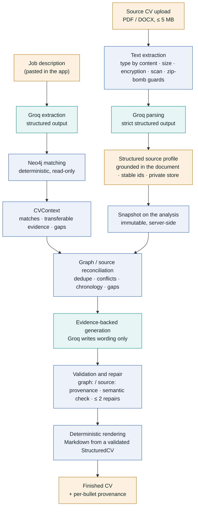

# CareerGraph architecture

*The LLM writes. The graph proves.*

This page describes how a CV is produced, which source is authoritative for which fact, and where every
safety check sits. The [README](../README.md) covers setup, configuration and privacy.

## The pipeline



Teal boxes are the three model calls (plus a fourth, the claim verifier, inside *validation*); blue boxes
are deterministic; amber boxes are data. Without a Source CV the left-hand branch and the reconciliation
step are skipped and the original graph-only flow runs unchanged.

## Who is authoritative for what

| Fact | Authority | Notes |
| --- | --- | --- |
| Achievements, evidence-backed bullets | **Neo4j** | Existing graph provenance is untouched. |
| Skills and capabilities | **Neo4j** | The CV's skill list is drawn only from graph-supported skills. |
| Quantified claims | **Neo4j**, where it has evidence for the role | On a role the graph has evidence for, a number that only the source CV states is rejected (`quantified_claim_needs_graph`). |
| Literal matches, transferable evidence, **gaps** | **Neo4j** | A gap is never claimed — even if the Source CV mentions the technology. |
| Name, e-mail, telephone, city/country, links | **Source CV** | Rendered directly from the validated profile; the model has no field for them and is never sent them. |
| Complete employment chronology | **Source CV** | Every source position appears exactly once. |
| Roles, education, projects not in the graph | **Source CV** | |
| Languages, certifications | **Source CV** | Plus any human language the graph lists that the CV does not. |

### When both know the same thing

Roles are matched by **normalised employer** (case, punctuation and legal suffixes such as GmbH ignored),
**overlapping periods** (unknown dates never contradict) and a **similar title** — or, if the titles
differ, only when it is unambiguously the one candidate on each side. A source role matches at most one
graph role and vice versa, so a role cannot appear twice.

For a matched role:

* graph value present, source absent → the graph's; source present, graph absent → the source **fills in**;
* both present and equivalent → the graph's spelling;
* both present and **different** → a `Conflict`. **Neither is chosen silently.** The disputed field is left
  out of the CV (the entry still appears with everything not in dispute) until the user explicitly picks
  *use my CV* or *use my career graph*. A resolution is bound to the exact pair of values: if either
  changes, it stops applying.
* A graph *Project* story's dates describe the project, not necessarily the whole role, so a wider source
  period is not a conflict; a graph period reaching **outside** the source period is. A graph *Role* node's
  period is exact.

Conflicts are recorded in the stored profile (so the review screen shows them) and returned with every
analysis. Conflicts *inside* the uploaded CV itself (an end date before its start, the same position
twice) are recorded at parse time.

## Provenance

Every bullet — and the profile paragraph — must cite evidence, in one of two namespaces that cannot be
mixed up:

```
graph:<evidence id>     verified in Neo4j:   graph:achievement:OrderSync#1, graph:story:OrderSync, graph:transferable:observability#1
source:<source fact id> from the candidate's own CV, from the profile SNAPSHOT this analysis holds:  source:f_1a2b3c4d
```

An id without a namespace, in the wrong namespace, unknown, or belonging to a different entry is
rejected. Source ids resolve against the analysis's **snapshot**, never the live stored profile.

Validation (all deterministic unless stated) rejects: unsupported numbers, skills, titles, seniority,
qualifications and named technologies; literal gaps; evidence-id / contact / graph-speak leaking into
prose; over-long compact entries; a missing or duplicated position; a header, contact block, education
entry, certification or language that differs from the verified record. Source-backed claims additionally
go through a **semantic verifier** (a separate model call that sees only the claim and what it cites and
must return `supported`; a missing verdict fails closed) — lexical checks alone cannot tell a reworded
claim from an embellished one.

### Bounded repair

A failed draft is not surfaced immediately. The specific invalid claims (target, rule code, current text,
the only evidence they may cite) go back to the model, which may **rewrite or remove only those**; edits
to anything else are discarded. The *whole* result is then revalidated. This happens at most **twice**;
then the CV is rejected with a report of rule codes and counts, and no rule has been relaxed.

## The Source CV store

```
<private dir>/source_cv/profile.json           manifest + parsed profile  (the single commit point)
<private dir>/source_cv/upload-<16 hex>.<pdf|docx>   the original, kept so it can be re-parsed
```

* `<private dir>` defaults to `data/private/` and is gitignored; override with `CAREERGRAPH_PRIVATE_DIR`.
* Every write is atomic (temp file → `fsync` → `os.replace`). Replacing writes the new original first, then
  swaps `profile.json`, then removes the old original; a crash leaves at most an unreferenced file, which
  the next operation removes.
* Writes are compare-and-set on the profile `revision`; a stale edit or racing upload gets
  `409 profile_version_conflict`.
* Stored file names are generated, never taken from the upload; a tampered manifest naming another path
  is refused. The original's SHA-256 is checked before a re-parse.
* Nothing in `source_cv/` imports Neo4j or a provider SDK. `SourceCvStore` is the seam for replacing this
  with authenticated database storage.

## Layout

| Path | Role |
| --- | --- |
| `backend/source_cv/` | Extraction, strict profile schema, grounding, store, service, reconciliation |
| `backend/llm/source_*.py` | Parser (Groq + dev), draft schemas, prompts |
| `backend/llm/complete_*.py` | Source-aware registry/payload, assembler + validator, writers + verifier |
| `backend/cv_generation.py` | The single choke point: writer → validate → (repair) → render |
| `backend/routes/source_cv.py` | Upload, review, edit, re-parse, delete |
| `pipeline/structured_cv.py` | `StructuredCV` — additive optional fields for contact, compact experience, certifications |
